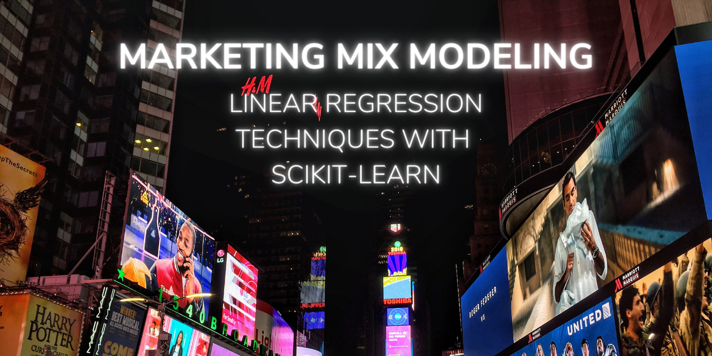

# Marketing Mix Modeling
**Author**: [Alex FitzGerald](https://www.linkedin.com/in/alex-fitzgerald-0734076a/)

## Overview
Media Mix Modeling is an analysis technique to understand and quantify the impact that advertising has on its desired goal, typically sales of the product being promoted. This project focuses on media mix modeling with different linear regression techniques of varying complexities. This works builds off of the work done by [Dr. Robert Kübler](https://github.com/Garve?tab=repositories) adding additional analysis tools marketers to implement in real-world scenarios.

## Business Problem
It has been said that 50% of advertising spend is wasted, the trouble is knowing which half. Advertisers need to understand where to allocate their marketing budgets to maximize ROI (return on advertising spend). In a world with limited budgets and many available channels, wasting 50% of your investment simply isn't good enough. Smart media planning begins with an informed ROI prediction across your advertising channels. Media Mix Modeling uses the historical data from the advertiser to draw connections between spend (X) and sales (y). These connections not only help illuminate the ROI of past investments, they unlock the ability to optimize future media plans.

## Data
In the data set [available here](https://medium.com/r/?url=https%3A%2F%2Fgithub.com%2FGarve%2Fdatasets%2Fblob%2F4576d323bf2b66c906d5130d686245ad205505cf%2Fmmm.csv) we see historical investment in three advertising channels by week over the course of 200 weeks. These will be our features in the linear regression model.
1. TV
2. Radio
3. Online Banners
We also have a column representing our target variable, Product Sales.
